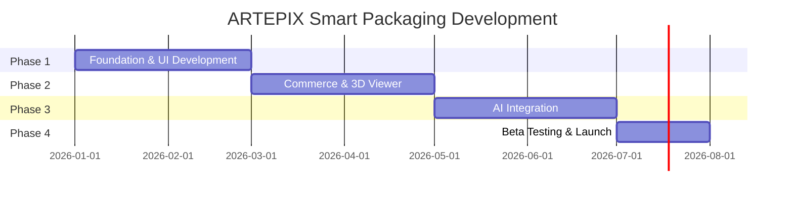

# 🗺️ ARTEPIX Smart Packaging App - Development Roadmap

> **Project Owner:** PT Artepix Multi Industri  
> **Platform:** Mobile App (Android & iOS)  
> **Start Date:** Januari 2026  
> **Estimated Launch:** Juli 2026

---

## 📅 Timeline Overview

---

## 🏗️ Phase 1: Foundation & UI Development (Bulan 1-2)

### Minggu 1-2: Project Setup & Design System
| Task | Prioritas | Status |
|------|-----------|--------|
| Setup Flutter project (Android & iOS) | 🔴 High | ⬜ Pending |
| Setup Backend repository (Python FastAPI) | 🔴 High | ⬜ Pending |
| Setup Database (PostgreSQL + MongoDB) | 🔴 High | ⬜ Pending |
| Create Liquid Glass Design System | 🔴 High | ⬜ Pending |
| Define Color Palette & Typography | 🟡 Medium | ⬜ Pending |

### Minggu 3-4: Core Screens Development
| Task | Prioritas | Status |
|------|-----------|--------|
| Splash Screen dengan animasi logo | 🔴 High | ⬜ Pending |
| AI Onboarding Flow (Pix Assistant) | 🔴 High | ⬜ Pending |
| Authentication (Google/Apple Sign-in) | 🔴 High | ⬜ Pending |
| Home Dashboard UI | 🔴 High | ⬜ Pending |

### Minggu 5-6: Product & Navigation
| Task | Prioritas | Status |
|------|-----------|--------|
| Bottom Navigation (Liquid Glass) | 🔴 High | ⬜ Pending |
| Product Category Grid | 🟡 Medium | ⬜ Pending |
| Product Detail Page | 🔴 High | ⬜ Pending |
| Dimension Input Component (PxLxT) | 🔴 High | ⬜ Pending |

### Minggu 7-8: Pricing Engine & Backend Foundation
| Task | Prioritas | Status |
|------|-----------|--------|
| Dynamic Pricing Algorithm (Python) | 🔴 High | ⬜ Pending |
| Database Schema Implementation | 🔴 High | ⬜ Pending |
| API Endpoints (Products, Users) | 🔴 High | ⬜ Pending |
| Real-time Price Calculation | 🔴 High | ⬜ Pending |

---

## 🛒 Phase 2: Commerce & 3D Viewer (Bulan 3-4)

### Minggu 9-10: Payment Integration
| Task | Prioritas | Status |
|------|-----------|--------|
| Midtrans Integration | 🔴 High | ⬜ Pending |
| DP 50% Payment Flow | 🔴 High | ⬜ Pending |
| Full Payment Flow | 🔴 High | ⬜ Pending |
| Order Confirmation UI | 🟡 Medium | ⬜ Pending |

### Minggu 11-12: 3D Viewer
| Task | Prioritas | Status |
|------|-----------|--------|
| model_viewer_plus Integration | 🔴 High | ⬜ Pending |
| 3D Model Asset Preparation | 🟡 Medium | ⬜ Pending |
| Interactive 3D Preview | 🔴 High | ⬜ Pending |
| Material/Texture Switcher | 🟡 Medium | ⬜ Pending |

### Minggu 13-14: Order & Project Management
| Task | Prioritas | Status |
|------|-----------|--------|
| Order System Backend | 🔴 High | ⬜ Pending |
| Project Timeline UI | 🔴 High | ⬜ Pending |
| Status Tracking System | 🔴 High | ⬜ Pending |
| Push Notifications | 🟡 Medium | ⬜ Pending |

### Minggu 15-16: Feed & Community
| Task | Prioritas | Status |
|------|-----------|--------|
| Pinterest-style Feed UI | 🟡 Medium | ⬜ Pending |
| Feed Content API | 🟡 Medium | ⬜ Pending |
| Inspiration Gallery | 🟢 Low | ⬜ Pending |

---

## 🤖 Phase 3: AI Integration (Bulan 5-6)

### Minggu 17-18: AI Design Generation
| Task | Prioritas | Status |
|------|-----------|--------|
| Stable Diffusion + ControlNet Setup | 🔴 High | ⬜ Pending |
| Text-to-Design API | 🔴 High | ⬜ Pending |
| Dieline Pattern Mapping | 🔴 High | ⬜ Pending |
| Design Preview UI | 🔴 High | ⬜ Pending |

### Minggu 19-20: AI Assistant
| Task | Prioritas | Status |
|------|-----------|--------|
| Gemini 1.5 Flash Integration | 🔴 High | ⬜ Pending |
| "Pix" Chatbot Backend | 🔴 High | ⬜ Pending |
| Business Profile Analysis | 🟡 Medium | ⬜ Pending |
| Product Recommendation Engine | 🟡 Medium | ⬜ Pending |

### Minggu 21-22: Mockup Editor
| Task | Prioritas | Status |
|------|-----------|--------|
| Design Studio UI | 🔴 High | ⬜ Pending |
| Upload & Drag-Drop Editor | 🔴 High | ⬜ Pending |
| UV Mapping to 3D Model | 🔴 High | ⬜ Pending |
| Design Export (Print-ready) | 🟡 Medium | ⬜ Pending |

### Minggu 23-24: Polish & Integration Test
| Task | Prioritas | Status |
|------|-----------|--------|
| End-to-end AI Flow Testing | 🔴 High | ⬜ Pending |
| Performance Optimization | 🔴 High | ⬜ Pending |
| Bug Fixes | 🔴 High | ⬜ Pending |

---

## 🧪 Phase 4: Beta Testing & Launch (Bulan 7)

### Minggu 25-26: Internal Testing
| Task | Prioritas | Status |
|------|-----------|--------|
| Pricing Accuracy Testing | 🔴 High | ⬜ Pending |
| Security Audit | 🔴 High | ⬜ Pending |
| Performance Testing | 🔴 High | ⬜ Pending |
| Bug Fixes & Refinement | 🔴 High | ⬜ Pending |

### Minggu 27-28: UAT & Launch
| Task | Prioritas | Status |
|------|-----------|--------|
| User Acceptance Test (Klien Loyal) | 🔴 High | ⬜ Pending |
| App Store Submission (iOS) | 🔴 High | ⬜ Pending |
| Play Store Submission (Android) | 🔴 High | ⬜ Pending |
| Launch Preparation | 🔴 High | ⬜ Pending |
| Soft Launch | 🔴 High | ⬜ Pending |

---

## 🎯 Key Milestones

| Milestone | Target Date | Status |
|-----------|-------------|--------|
| 📋 Design System Complete | Feb 2026 W2 | ⬜ |
| 🎨 UI Prototype Ready | Feb 2026 W4 | ⬜ |
| 💰 Pricing Engine Live | Feb 2026 W4 | ⬜ |
| 💳 Payment Integration Done | Apr 2026 W2 | ⬜ |
| 📦 3D Viewer Working | Apr 2026 W4 | ⬜ |
| 🤖 AI Features Complete | Jun 2026 W4 | ⬜ |
| ✅ Beta Testing Complete | Jul 2026 W2 | ⬜ |
| 🚀 App Launch | Jul 2026 W4 | ⬜ |

---

## 📊 Team Resources (Rekomendasi)

| Role | Jumlah | Responsibility |
|------|--------|----------------|
| Flutter Developer | 2 | Mobile UI/UX Development |
| Backend Developer (Python) | 1-2 | API, Database, Pricing Engine |
| AI/ML Engineer | 1 | Stable Diffusion, Gemini Integration |
| UI/UX Designer | 1 | Design System, Wireframes, Prototypes |
| QA Engineer | 1 | Testing, Quality Assurance |
| Project Manager | 1 | Coordination, Timeline Management |

---

## 📝 Notes

> **Catatan Penting:**
> - Fokus utama adalah **Pricing Engine** dan **User Experience**
> - Kalkulasi harga harus divalidasi dengan tim estimator percetakan Artepix
> - Semua transisi layar harus menggunakan animasi halus (Liquid feel)
> - Backend dan Mobile dalam repository terpisah untuk performa optimal
